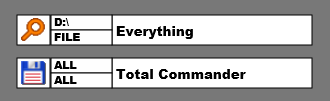

# RainmeterSkin: SearchBar Everything + TC
This is a small litte Rainmeter searchbar skin for the programm "Everything" and "Total Commander"
to make fast searches on specified drives and folder or files directly from the desktop.

Everything: https://www.voidtools.com   
Total Commander: https://www.ghisler.com  

The Skin is inspired from "Search+" skin by Bgd69 (http://bgd69.deviantart.com/art/Search-425781470).

Special thanks goes to Christian Gishler for the permission to use his "Total Commander" Icon and
David Carpenter to use his "Everything" Icon for this Skin.

# Usage
1. It's a Rainmeter skin you need Rainmeter
2. You need "Everything" installed and/or "Total Commander"
3. Install the *.rmskin file
4. Important! Edit the "SearchBar.cfg" to your needs. Add the drives you wan't and
the correct programm paths. Keep it LUA Language conform (normally you just need to know that you
have to use double backslashes instead of single backslashes)
