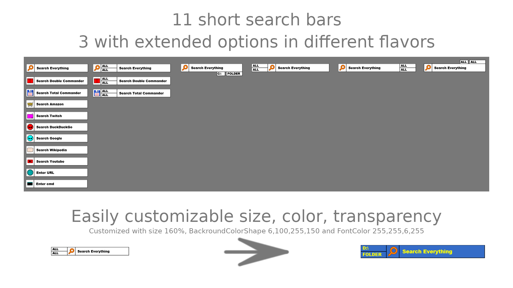

# RainmeterSkin: Extendable SearchBar

The following search bars (=plugins) are currently provided:

+ amazon
+ commandline
+ doublecommander
+ doublecommander_small
+ everything
+ everything_small
+ totalcommander
+ totalcommander_small
+ twitch
+ urlopen
+ websearch (DuckDuckGo)
+ websearch (google)
+ wikipedia
+ youtube

For configuration read the FAQ.txt.  
For plugin development read development.txt.  
There both located after Skin installation in "@Resources\_notes".   

## What makes this search bar different from others?
1. Easily scalable for high dpi screens.
2. Easily customizable for your current skin setting (color, font...).
3. Easily expendable with you're needed bar.
4. Saves current skin setting when closed.
5. Choose which plugins you really need.

## How to use?
1. It's a Rainmeter skin you need "[Rainmeter](https://www.rainmeter.net/)"
2. For Everything bar you need: "[Everything](https://www.voidtools.com/)"
2. For Double Commander bar you need: "[Double Commander](https://doublecmd.sourceforge.io/)" and "[Autohotkey](https://www.autohotkey.com/)"
   For Total Commander bar you need: "[Total Commander](https://www.ghisler.com)" and "[Autohotkey](https://www.autohotkey.com/)"
3. Install the *.rmskin file
4. Edit the "Searchbar.cfg.lua" for the **technical** aspects like required
   plugins and drive letters.
5. Edit the Searchbar<flavor>.ini for the **appearance** of the Skin.
6. Don't forget tor renew skin after changes inf cfg file! 
6. If you have Problems, read the provided FAQ.txt, "[Rainmeter Getting Started](https://docs.rainmeter.net/manual/getting-started/)",
   ask here for help in the comments or ask in the Rainmeter forum.

## Where is file X?

After you installed the rmskin file, open the skin folder in you're explorer (right click open skin folder in Rainmeter).

"SearchBar.cfg.lua"                     --> edit for technical things

"Searchbar<flavor>.ini"                 --> edit for appearance

"@Resources\\_notes\\FAQ.txt"   	    --> more information for configuration

"@Resources\\_notes\\development.txt" 	--> more information for development
